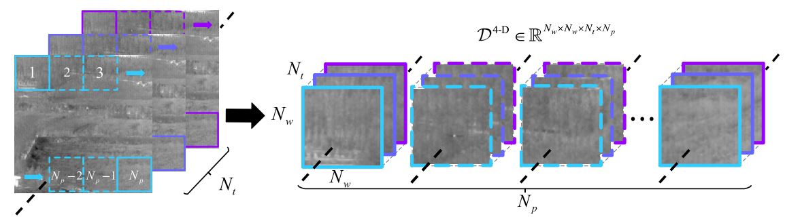
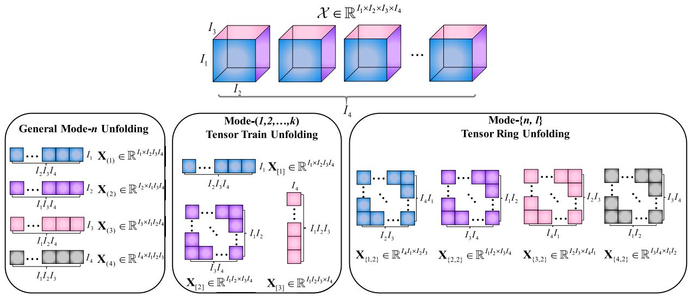
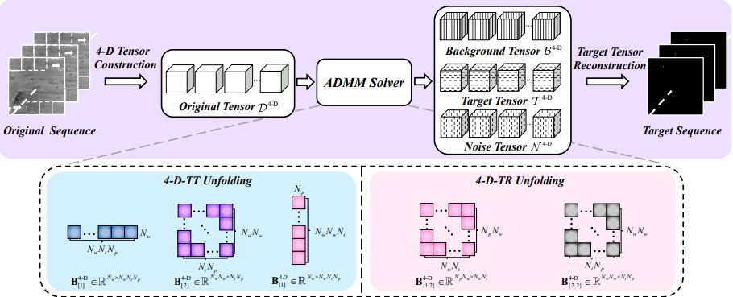
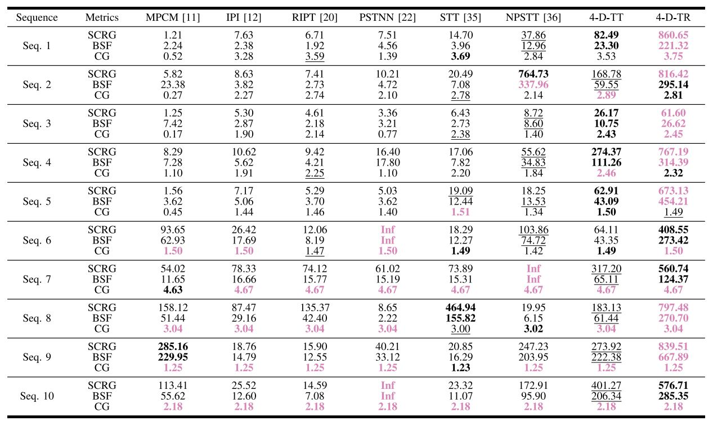
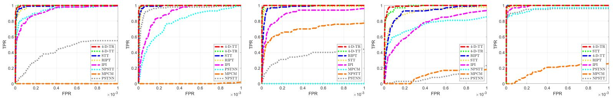
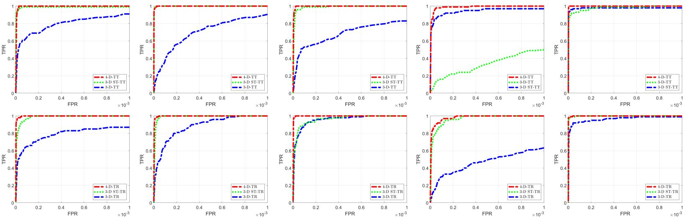

# Code 4D ISTD
[](https://github.com/fengyiwu98/4D_ISTD)

[](./LICENSE)

This repository is for official implementation for the following paper and is built in Matlab R2020b.

> **Wu, F**., Yu, H., Liu, A., Luo, J., & Peng, Z*. (2023). Infrared Small Target Detection Using Spatio-Temporal 4D Tensor Train and Ring Unfolding. IEEE Transactions on Geoscience and Remote Sensing. [[link](https://ieeexplore.ieee.org/abstract/document/10156866)]

For more information about me, you can visit my [persional website](https://fengyiwu98.github.io/).

## Contents
1. [Introduction](#introduction)
2. [Method](#Method)
3. [Test](#test)
4. [Results](#results)
5. [Citation](#citation)

## Introduction
Infrared small target detection (ISTD) is vital for civil and military applications. However, existing methods often face challenges in coping with complex scenes, discriminating targets from similar objects, or leveraging temporal information effectively. To tackle these limitations, we offer an innovative approach that exploits the spatiotemporal structure of infrared images. A 4-D infrared tensor is initially constructed from a sequence of infrared images and decomposed into lower dimensional tensors using the tensor train (TT) and its extension—tensor ring (TR) techniques. The ISTD problem is then formulated as a sparse plus low-rank decomposition problem, where the sparse part is the target and the low-rank part is the background. We factorize the composed tensors into matrices via TT and TR unfolding approaches, which mitigates the imbalance between different modes containing spatial and temporal information. By constraining the balanced unfolded components with the weighted sum of nuclear norm, we solve the problem using the alternating direction multiplier method (ADMM). Furthermore, we validate models on several datasets and benchmark them with state-of-the-art techniques in detection accuracy and background suppression. Comparison results demonstrate the superiority of our approach over the existing methods. Moreover, the results of an ablation study with 3-D tensor structures show the effectiveness and feasibility of the dimension expansion to 4-D.

## Method

<center>
    
    <br>
    <div style="color:orange; border-bottom: 1px solid #d9d9d9;
    display: inline-block;
    color: #999;
    padding: 2px;">Figure 1. Construction of the 4D Infrared Tensor.</div>
</center>

<center>
    
    <br>
    <div style="color:orange; border-bottom: 1px solid #d9d9d9;
    display: inline-block;
    color: #999;
    padding: 2px;">Figure 2. Visualization of TT/TR Unfolding methods on 4D Tensor.</div>
</center>

<center>
    
    <br>
    <div style="color:orange; border-bottom: 1px solid #d9d9d9;
    display: inline-block;
    color: #999;
    padding: 2px;">Figure 3. Overall procedure of 4D-TT/TR models.</div>
</center>


## Test
### Quick start
1. Download the code and test images.

2. Modify the image path in the `TR.m` or `TT.m`, and run the file.


## Results

### SCRG, BSF, CG 

<center>
    
    <br>
    <div style="color:orange; border-bottom: 1px solid #d9d9d9;
    display: inline-block;
    color: #999;
    padding: 2px;">Figure 4. SCRG, BSF, CG measurements for our and compared methods.</div>
</center>  

### ROC

<center>
    
    <br>
    <div style="color:orange; border-bottom: 1px solid #d9d9d9;
    display: inline-block;
    color: #999;
    padding: 2px;">Figure 5. ROC measurements for our and compared methods.</div>
</center> 

### Ablation Studies

<center>
    
    <br>
    <div style="color:orange; border-bottom: 1px solid #d9d9d9;
    display: inline-block;
    color: #999;
    padding: 2px;">Figure 6. Ablation studies for the dimension expansion.</div>
</center> 


For more information, please refer to our [paper](https://www.sciencedirect.com/science/article/pii/S0925231220313461).

## Citation
If you find the code helpful in your resarch or work, please cite the following papers.

> **Wu, F**., Yu, H., Liu, A., Luo, J., & Peng, Z*. (2023). Infrared Small Target Detection Using Spatio-Temporal 4D Tensor Train and Ring Unfolding. IEEE Transactions on Geoscience and Remote Sensing. [[link](https://ieeexplore.ieee.org/abstract/document/10156866)]

```
@ARTICLE{10156866,
  author={Wu, Fengyi and Yu, Hang and Liu, Anran and Luo, Junhai and Peng, Zhenming},
  journal={IEEE Transactions on Geoscience and Remote Sensing}, 
  title={Infrared Small Target Detection Using Spatiotemporal 4-D Tensor Train and Ring Unfolding}, 
  year={2023},
  volume={61},
  number={},
  pages={1-22},
  doi={10.1109/TGRS.2023.3288024}}
```
